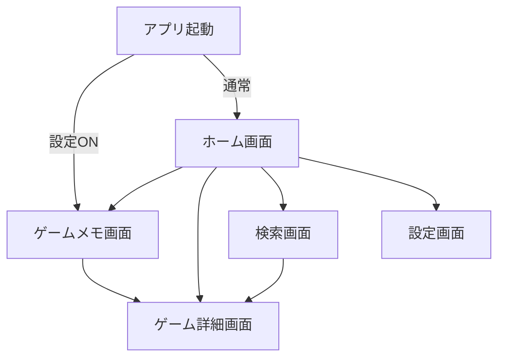

# ゲームコンシェルジュ UIプロトタイプ設計

## 画面一覧
1. **ホーム画面（ゲーム一覧）** - ゲームオブジェクトの管理ハブ・メイン機能
2. **ゲームメモ画面** - メモオブジェクトの作成・編集に特化
3. **ゲーム詳細画面** - ゲーム情報表示・追加管理
4. **検索画面** - 新しいゲームオブジェクトの発見・追加
5. **設定画面** - アプリ設定の管理

## 機能一覧

### ホーム画面（ゲーム一覧）
**ゲームオブジェクト**:
- **ゲーム表示**: タイトル・パッケージ画像・プレイ中フラグ表示
- **優先表示**: プレイ中ゲームを大きめ表示・多機能ボタン
- **絞り込み**: 所持済み/気になるリスト/お気に入り/プレイ中フラグ別
- **並び替え**: 追加日順・タイトル順・活動順
- **状態管理**: プレイ中フラグの1タップ切り替え
- **クイックアクション**: 所持ゲーム→メモ画面、未所持→詳細画面

**タブナビゲーション**:
- **ゲーム一覧**: メインタブ
- **検索**: ゲーム検索・追加
- **ニュース**: ゲーム関連情報（将来拡張）
- **設定**: アプリ設定

### ゲームメモ画面
**メモオブジェクト**:
- **統合メモ表示**: 進行状況・TODO・その他メモ
- **インライン編集**: 画面遷移なしでメモ編集・保存
- **攻略情報**: 外部リンク・参考情報へのアクセス

**ゲームオブジェクト**:
- **基本情報**: タイトル・パッケージ画像
- **詳細遷移**: ゲーム詳細画面への遷移ボタン

### ゲーム詳細画面
**ゲームオブジェクト**:
- **情報表示**: 基本情報・パッケージ画像・外部リンク
- **外部リンク**: 公式サイト・Wikipedia・eShop等
- **追加管理**: 所持済み/気になるリスト・プレイ中フラグ設定

### 検索画面
**ゲームオブジェクト**:
- **検索機能**: タイトル・ジャンルによる外部API検索
- **クイック追加**: 検索結果から直接コレクション追加
- **詳細確認**: より詳しい情報確認のための詳細画面遷移

### 設定画面
**設定オブジェクト**:
- **表示設定**: 一覧表示形式・ソート初期値
- **起動設定**: アプリ起動時のプレイ中ゲーム自動表示
- **データ管理**: バックアップ・復元・エクスポート

## 画面フロー

## 主要ユーザージャーニー

1. **次プレイするゲーム決定**: 
   - ホーム一覧を眺める → 並び替え/絞り込み → ゲーム選択
   - 必要に応じてメモ確認 → 最終決定

2. **新ゲーム探し**:
   - ホーム一覧確認 → 気分に合うものがない → 検索 → 追加

3. **プレイ中記録**: 
   - 起動 → プレイ中ゲーム画面（オプション）→ メモ編集